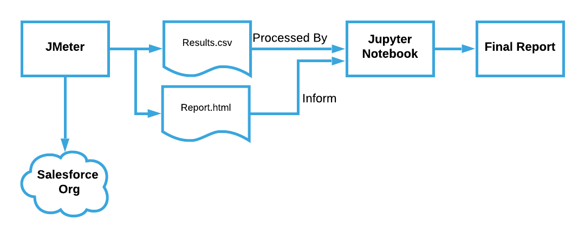

# Salesforce DX JMeter Example

---
This is an example project for getting started with JMeter for
testing Salesforce Apex REST services. This repo demonstrates how to construct a performance testing pipeline using _JMeter_ and _Jupyter Notebooks_.  


## Getting Started
### Setup the Project
Install all of the tools and required dependencies by going through the 
[Setting Things Up](./docs/setup.md) document.

### Create a Scratch Org to Test Against
Provision a scratch org and deploy the metadata using the NPM helper script.
```shell
npm run scratch:init
```

### (Optional) Manually Invoking the Web Service

There is a helper Bash script for manually invoking the REST service. This
is provided to give an example of how to use the Salesforce CLI to handle
authentication. The following steps demonstrate how to use the helper script
to manually call the REST service. You don't have to do this, it is provided 
for debugging purposes.

1. Navigate to the script's directory.

```shell
cd scripts/bash
```

2. Give the script permission to run.

```shell
chmod +x call_hello_world.sh
```

3. Run the Script. This assumes you've already provisioned a scratch org and
   deployed the service's metadata.

```shell
./call_hello_world.sh
```

### Exploring Performance Testing
JMeter is responsible for running the tests and Jupyter is leveraged for 
analyzing the test results. See the below documents for details on how
to use each tool.

- [Running the JMeter Tests](./docs/jmeter_help.md)
- [Working with the Jupyter Notebooks](./docs/jupyter_help.md)